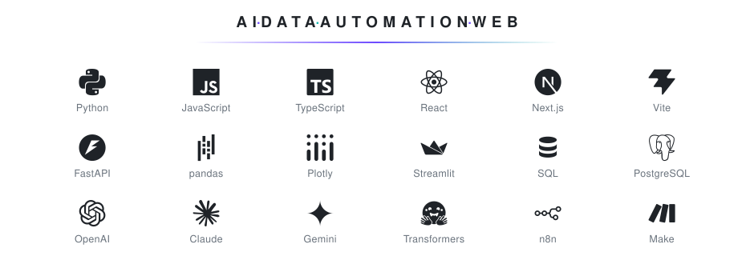

# ㅤㅤ˙ᵕ˙ Oi, eu sou a Heloisa

Gosto de criar coisas. Às vezes elas resolvem problemas reais, às vezes são só uma ideia que eu quis tirar do papel.

Trabalho principalmente com IA, dados, automação e desenvolvimento web.

## Com o que eu construo

<picture>
  <source media="(prefers-color-scheme: dark)" srcset="tec-escuro-v2.svg">
  
</picture>

## ಄ Em desenvolvimento 

**Pertin**  em pré-incubação
Transformando localização em uma informação mais útil para imóveis e hospedagens.

**ESG Extractor**  em processo de licenciamento de software
Extraindo informações estruturadas de relatórios de sustentabilidade.

**Foodie Vision**  melhorando o treinamento com imagens
Explorando visão computacional aplicada a alimentos.

## ☆ Alguns projetos públicos

[**Meu HackTown**](https://github.com/helo-labs/meu-hacktown) · planejamento e curadoria para o HackTown 2026

[**Alô Voice Agents Kit**](https://github.com/helo-labs/alo-voice-agents-kit) · kit para criar e testar agentes de voz

[**CataLead**](https://github.com/helo-labs/catalead) · radar de comentários para quem vende pelo Instagram

[**Coffee Insight**](https://github.com/helo-labs/coffee-insight) · análise exploratória de dados de vendas

 

EN · I like building things. Sometimes they solve real problems, sometimes they're just ideas I wanted to bring to life.

I mainly work with AI, data, automation, and web development.
